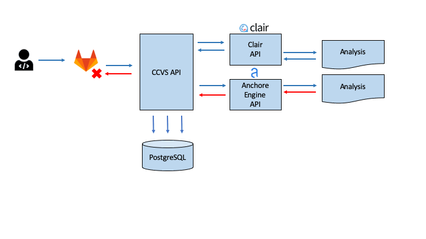

# CCVS

<b>Central Container Vulnerability Scanning</b>, A central API to scan containers images using different vendors.
There are multiples tools to scan containers/images(open source or not). But each one can show different results because use different approach. So we decide to use multiples tools and have a complete vision of vulnerabilities

## Overview
A central API to scan docker images using different vendors and centralizes all results into a database for further analysis and metrics.

### How does it work?
The main goal of this project is to help development teams improve the quality of their docker images by finding vulnerabilities and thus addressing them.

CCVS can perform security analysis using Anchore[https://github.com/anchore/anchore-engine] and Clair[https://github.com/coreos/clair]

#### Why use different tools?
There many tools to scan docker images, but sometimes the results can be diferent.

#### Articles comparing tools
- [Open Source CVE Scanner Round-Up: Clair vs Anchore vs Trivy](https://boxboat.com/2020/04/24/image-scanning-tech-compared/)
- [5 open source tools for container security](https://opensource.com/article/18/8/tools-container-security)

## Architecture

## Documentation
- [API](docs/api.md)
- [Environment Variables](docs/env-vars.md)
